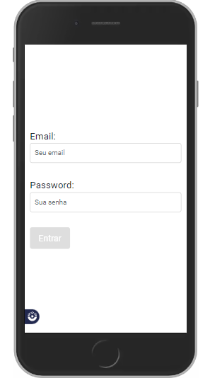
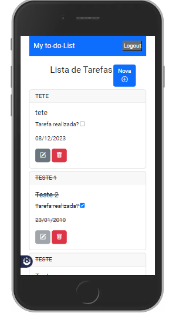
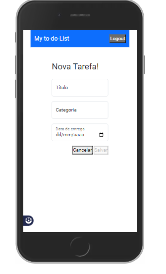
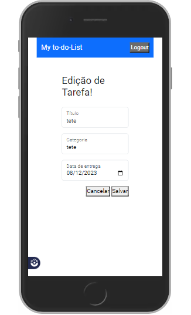
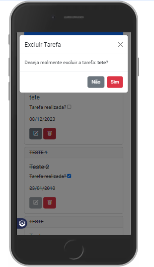

# Santander Coders 2023 | ADA
# Turma 1004 - Projeto final - Angular II

## O que?

Desenvolver, utilizando os conceitos abordados ao longo do módulo, uma aplicação de lista de tarefas (ToDo List).

---

## Funcionalidades

Dentre as funcionalidades, espera-se que seja possível:

- Adicionar uma tarefa;
- Editar uma tarefa salva;
- Remover uma tarefa salva;
- Listar todas as tarefas salvas

---

## Requisitos

Como requisitos, espera-se que o projeto implemente todos os tópicos abordados em aula. A saber:

- Rotas e navegação;
- Services e Injeção de Dependências;
- Observables;
- Requisições HTTP;
- Autenticação e Proteção de Rotas;
- NgModules

---

## Observações

- As equipes terão entre 4 e 5 componentes;
- O prazo para a entrega é nossa última aula (24/11/2023);
- O backend será fornecido pelo professor e estará disponível no repositório ([Link a ser disponibilizado](https://github.com/ivirson/TO-DO-Api));
- Caso a equipe deseje, pode usar um outro backend, respeitando os requisitos e funcionalidades esperadas;
- O vídeo apresentado em aula é um norte, mas não é requisito. Portanto, podem explorar novos cenários, se optarem por isso.

------------------------------------------------------------------------------------------------------------

# ProjetoTodoList

This project was generated with [Angular CLI](https://github.com/angular/angular-cli) version 16.2.5.

## Development server

Run `ng serve` for a dev server. Navigate to `http://localhost:4200/`. The application will automatically reload if you change any of the source files.

## Build

Run `ng build` to build the project. The build artifacts will be stored in the `dist/` directory.

## Further help

To get more help on the Angular CLI use `ng help` or go check out the [Angular CLI Overview and Command Reference](https://angular.io/cli) page.

## Screens Shots:

## Squad:

### Clóvis Garcia [Github](https://github.com/theviolatorx/)

#

### Emily Jenifer [Github](https://github.com/emsjenifer)

#

### Gleidson Medeiros [Github](https://github.com/gleidsonlm)

#

### Henrique Gal [Github](https://github.com/HGalieta)

